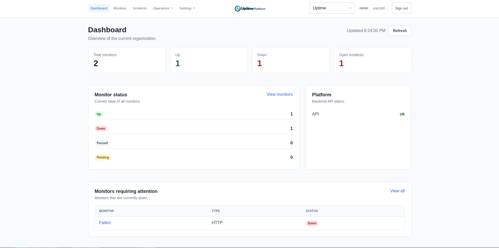
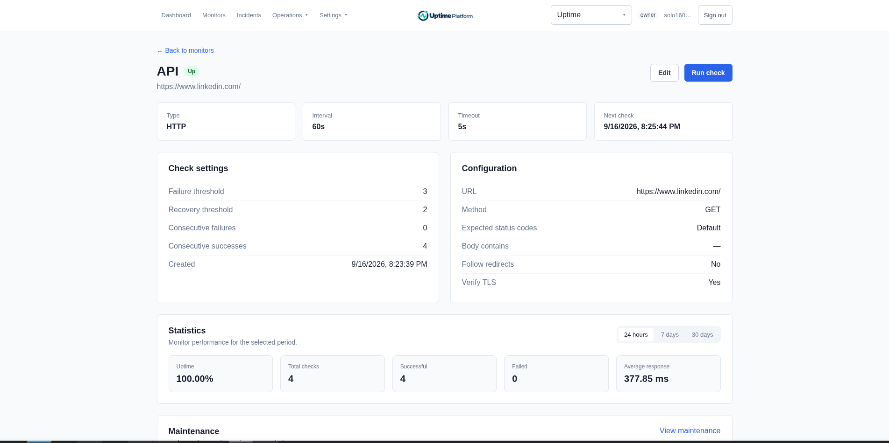
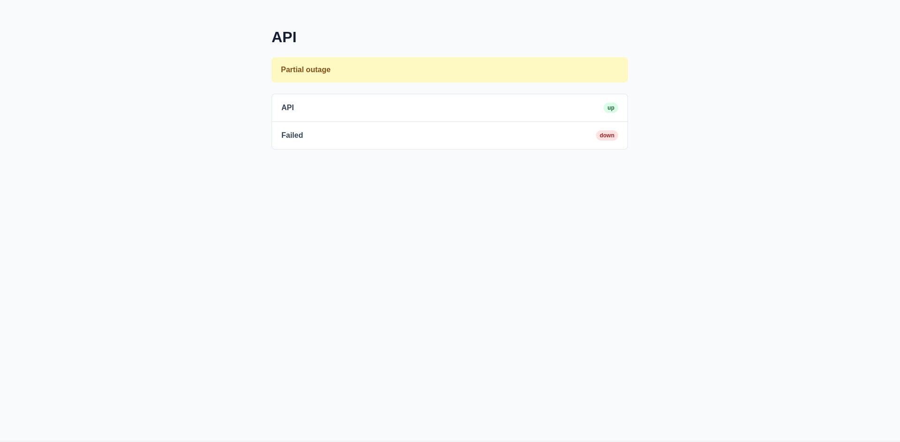

# Uptime Platform


Self-hosted uptime monitoring with a FastAPI backend and Vue 3 dashboard.

- HTTP, TCP, DNS, TLS certificate and ICMP checks.
- Incidents, maintenance windows, webhook, Telegram and email notifications.
- Public status pages, organizations, roles and API keys.
- PostgreSQL, concurrent schedulers and notification workers.
- Optional HTTPS, Prometheus and Grafana.

## Install

Requires Linux, Docker Compose v2, Bash, Python 3, curl, openssl, getent and flock.

```bash
curl -fL https://raw.githubusercontent.com/nightingale-develop/uptime-platform/refs/tags/latest/install.sh -o install.sh
sudo bash install.sh
```

The installer creates `/opt/uptime-platform`, configures Docker and asks for an
address and the initial organization owner's credentials.

- **This computer:** select `localhost`, then open <http://localhost:8080>.
- **Domain:** configure DNS and open ports 80/443; Caddy provides HTTPS.
- **IP address:** Caddy uses a private CA that must be trusted on client devices.

API documentation: `<application URL>/backend/docs`.

## Screenshots





## Update or reinstall

Installation and updates always use `/opt/uptime-platform`:

```bash
curl -fL https://raw.githubusercontent.com/nightingale-develop/uptime-platform/refs/tags/latest/update.sh -o update.sh
sudo bash update.sh
```

The updater selects the latest stable version. To update to a specific
version, use `sudo bash update.sh --version 1.3.1`.

Updates preserve configuration and data volumes and create a database backup.
See [installation and updates](docs/updating.md) for details and clean reinstall.
History is automatically removed after its [retention period](docs/retention.md).

## Check the application

Use the installation directory:

```bash
cd /opt/uptime-platform
sudo docker compose ps -a
sudo docker compose logs --tail=50 api scheduler notification-worker
curl -fsS http://localhost:8080/backend/health
```

Expected health response: `{"status":"ok"}`. This checks API availability;
worker progress is monitored separately.

## Prometheus and Grafana

Add `--observability` to the update command above to enable monitoring.
Existing monitoring is retained.

- [Prometheus](http://localhost:9090): check **Status → Targets** and **Alerts**.
- [Grafana](http://localhost:3000): initial login `admin` / `admin`; change the password.
- The data source and [dashboard](observability/grafana/dashboards/uptime-platform.json)
  are provisioned automatically. The same JSON can be imported into another Grafana.

Both interfaces bind to localhost; use an SSH tunnel for remote access.
Metrics cover checks, scheduler/worker progress, deliveries and notification backlog.
Counters reset on process restart; backlog comes from PostgreSQL. Alert delivery
requires a separately configured Alertmanager.

```bash
sudo docker compose --profile observability stop grafana prometheus
```

## Documentation

- [Installation, updates and clean reinstall](docs/updating.md)
- [Local development and Make commands](docs/development.md)
- [Scheduler coordination](docs/scheduler.md)
- [Notification worker coordination](docs/notification-worker.md)
- [Data retention and cleanup](docs/retention.md)
- [Contributing](CONTRIBUTING.md)
- [Security policy](SECURITY.md)
- [Code of conduct](CODE_OF_CONDUCT.md)
- [Pull request template](.github/pull_request_template.md)
- [MIT license](LICENSE)
